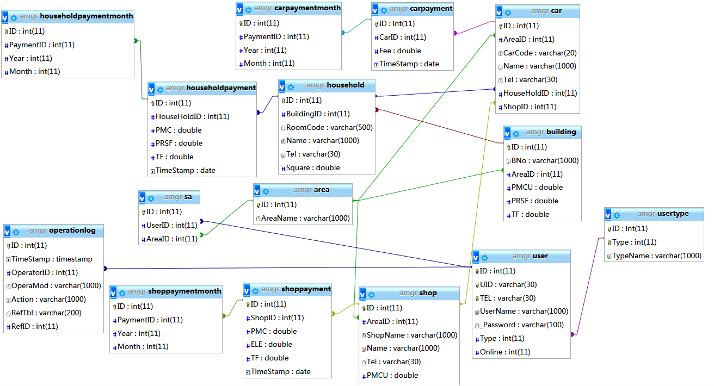

# AccountMgr

> Property Account Management System Template (Based on PHP 5.6, MySQL 5.7.9,JQuery 1.11.1, and Bootstrap 3.3.7)

## DataBase Overview



## Usage

1. Create a database in MySQL named "amgr" while PHP, MySQL and Apache environments are ready
2. Import the sql file "amgr.sql" into database "amgr" to create tables and procedures
3. Use the default superuser account below to login the system in this URL: http(s)://[Domain name or IP]/AccountMgr/index.php
```
Default Superuser Account:
ID Card Number: 111111111111111111
Telephone Number: 11111111111
Password: 123123
```
**Requirements:**
PHP, MySQL and Apache environments